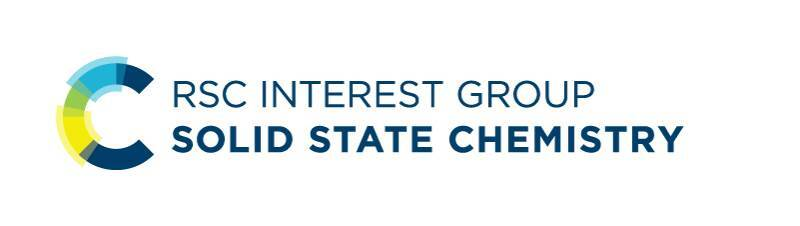

  

## Solid Data Summer School 2025: Data in Solid-State Chemistry

Join us at the University of Birmingham in Summer 2025 for the inaugural **Solid Data Summer School**. This school bridges the gap between data science and solid-state chemistry, equipping post-graduate researchers with the skills needed to excel in a data-centric scientific landscape.

Participants will gain hands-on experience in data management, analysis techniques, and computational tools tailored to solid-state chemistry problems. Designed with a focus on empowering experimentalists, the summer school integrates foundational lectures on data science with team-based projects that blend computational modeling and experimental data interpretation.

### Key Details
- **When**: 21st-24th July 2025 
- **Where**: University of Birmingham, UK  
- **Cost**: £50, including accommodation.

Generously supported by the Royal Society of Chemistry Solid State Chemistry Group. 

  

