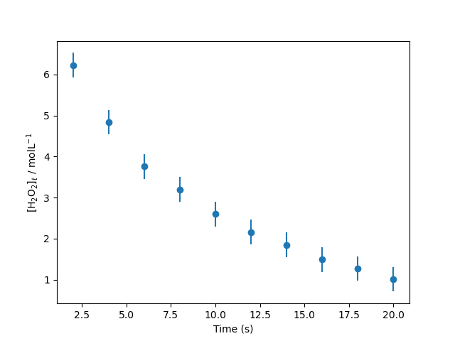
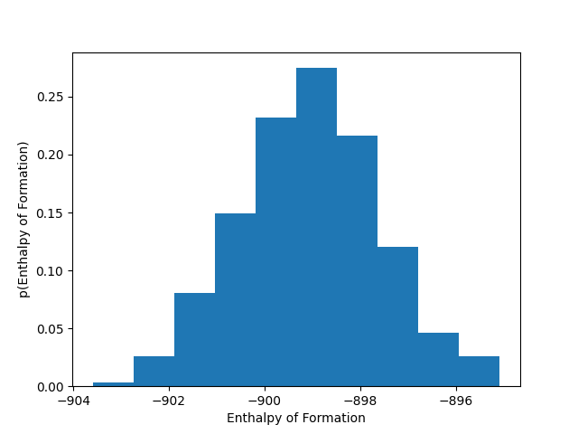

<script type="text/x-mathjax-config">
    MathJax.Hub.Config({
      tex2jax: {
        skipTags: ['script', 'noscript', 'style', 'textarea', 'pre'],
        inlineMath: [['$','$']]
      }
    });
  </script>
  <script src="https://cdn.mathjax.org/mathjax/latest/MathJax.js?config=TeX-AMS-MML_HTMLorMML" type="text/javascript"></script> 

# Linear Algebra

The ability to rotate a molecule in space is an important aspect in computational chemistry. 
Indeed, tools such as machine learning interatomic potentials are build on the use of what are called rotation matrices. 
A rotation matrix is a linear transformation that describes rotation of a series of vectors, the atomic positions of some atoms. 
The rotation matrix for an anti-clockwise rotation in a two-dimensional *xy*-plane is as follows, 

$$
\mathbf{R} = \begin{bmatrix} \cos{\theta} & -\sin{\theta} \\ \sin{\theta} & \cos{\theta} \end{bmatrix}.
$$

A text file with *x* and *y* coordinates of a water molecule is available for download [here](./water.txt). 
This file looks like that shown below. 

```
# water molecule xy
# x y
0 0
-0.82 -0.48
0.82 -0.48
```

After the first two lines, which are comments describing the file, there are three lines of coordinates. 
The first line is the *x* and *y* positions of the oxygen molecule and then the next lines are the same for the two hydrogen atoms. 
Therefore, if plotted on *x* and *y*-axes, the oxygen atom would sit at the origin, $(0, 0)$, and the hydrogen atoms at $(-0.82, -0.48)$ and $(0.82, -0.48)$. 
The atomic positions of the water molecule can be read using [`np.loadtxt`](https://numpy.org/doc/stable/reference/generated/numpy.loadtxt). 

To visualise the water molecule, the [`visualisation.py`](./visualisation.py) module can be downloaded and imported as a module. 
This module includes the `visualisation.show()` function, to which the atomic positions should be passed. 

Create a Python function that will rotate the water molecule using the rotation matrix defined above. 
Use the `visualisation.show` function to check the rotation has worked correctly. 

# Probabilistic Analysis

The ability to compare model data to experimental data is an essential tool in the prediction of chemical structure. 
If you have some experimental data, the ability to check if the model that you propose to describe the data requires a metric of comparison. 
The *likelihood* is a probabilistic/Baeyesian metric that describes how likely it is that the model describes the observed data. 

Consider the catalytic decomposition of hydrogen peroxide in the presence of excess cerium(III) ion, which follows first-order rate kinetics. 
This means that the concentration of H<sub>2</sub>O<sub>2</sub> decreases exponentially with time $t$, 

$$
[\text{H_2O_2}]_t = [\text{H_2O_2}]_0 \exp(-kt), 
$$

where $k$ is the rate constant for the reaction (our model parameter). 

Experimental data measuring this decomposition can be downloaded [here](./first-order.txt) and read in with [`np.loadtxt`](https://numpy.org/doc/stable/reference/generated/numpy.loadtxt). 
Plotted, the experimental data can be see below. 

<center>

</center>

Find the maximum likelihood estimation of the rate constant.
To achieve this, you should first define a multidimensional normal distribution that describes the experimental data and a function for the first order rate equation. 
The optimal rate constant can be found by minimising the negative log-likelihood. 
*Note*: you [should not linearise the above equation](https://doi.org/10.1021/acs.jchemed.3c00466) to find $k$ by linear regression.

# Cluster Analysis

The ability to cluster similar datasets has been extremely useful in the discovery of new materials. 
By forming clusters in some space, distinct forms of some materials may by observed. 

You colleagues has come to you with a database of [experimentally determined features](./clustering.txt) (energy of formation, melting point, and unit cell volume).
They would like to know if their data represents more than one polymorph of the molecule they are interested in. 
If it does, they have potentially discovered a new polymorph. 
They have highlighted that the enthalpy of formation appears to be normally distributed, as shown below. 

<center>

</center>

Use *k*-means clustering to cluster the data using 1, 2, and 3 clusters. 
Determine the optimal numbers of clusters and, therefore, help your colleague understand if they have discovered a new polymorph of their molecule. 

# Dimensionality Reduction

Another colleague has colllected significantly [more data](./polymorph.csv) to help the disambiguation of two polymorphs.
This is stored as a .csv file. 
They have also identified the space group of each of the crystals they have collected, but want to understand which of the features have the biggest impact on the resulting space group. 

They have asked you to using a dimensionality reduction technique to find the features that lead to the greatest variance. 
Knowledge of these features will help them to rationally design future materials with desirable properties. 
Your colleague has requested a visualisation, showing how the different space groups can be identified by considering a higher dimension description of the data. 
